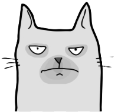

  <a href="https://www.grumpycat.cloud">
    
    <h1 align="center">Grumpy Cat</h1>
  </a>

    <h3 align="center"> Grumpy Cat, an interactive cat using ChatGPT api</h3>

#### Features

- Light/Dark mode toggle
- Live previews
- Progressive Web Apps
- SEO friendly
- Sass preprocessor scripting language

### Tech Stack

**Client:** React, Next, Sass with TailwindCSS inspired

**Server:** Node, MongoDB, Firebase

**Deployment:** Vercel, Firebase, Hostinger, Cloudflare

---

### Contributors

[Frederic Da silva](https://github.com/fredericdasilva)

### License

[MIT](./license)
